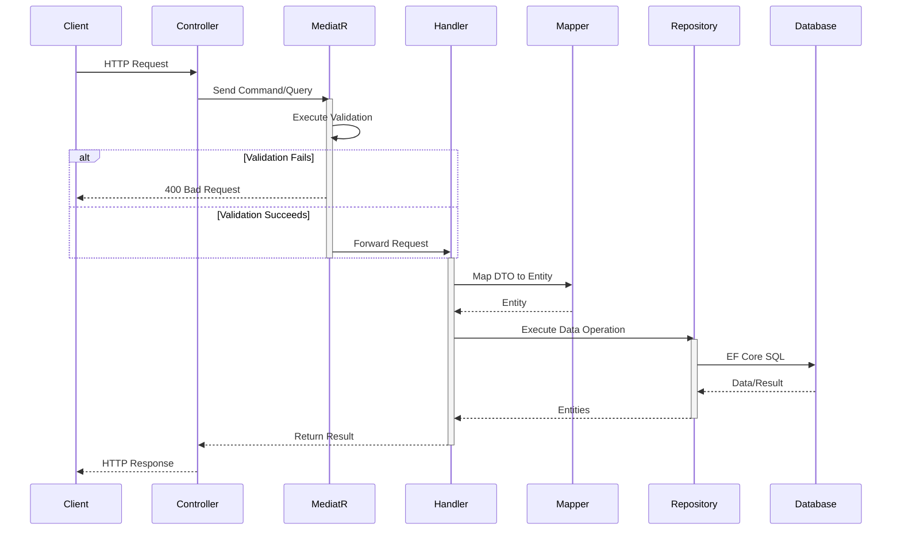

# Task Manager API

A modern, robust backend REST API for a Task Management application, built with **.NET 9.0** and following enterprise-grade design patterns. 

This project demonstrates the effective implementation of **Clean Architecture** and the **CQRS (Command Query Responsibility Segregation)** pattern to ensure separation of concerns, scalability, and maintainability.

---

## • Architecture Overview

The application is built on the principles of **Clean Architecture**, divided into four distinct layers:

1. **Domain Layer (`TaskManager.Domain`)**
   - The core of the application. Contains entities (`Project`, `ProjectTask`, `ApplicationUser`), Enums, custom Exceptions (`NotFoundException`, `BadRequestException`), and repository interfaces.
   - *Rule: Has no dependencies on any other project.*

2. **Application Layer (`TaskManager.Application`)**
   - Contains the core business logic.
   - Implements **CQRS** using **MediatR**:
     - **Commands** (e.g., `CreateTaskCommand`, `UpdateProjectCommand`) for state-changing operations.
     - **Queries** (e.g., `GetProjectsQuery`, `GetProjectTasksQuery`) for data retrieval operations.
   - Uses **Mapster** for object mapping (DTOs to Entities) via the `IMapper` interface.
   - Employs **FluentValidation** integrated directly into the MediatR pipeline (`ValidationBehavior`) to automatically validate incoming Requests before they reach their Handlers.
   - *Rule: Depends only on the Domain layer.*

3. **Infrastructure Layer (`TaskManager.Infrastructure`)**
   - Implements the interfaces defined in the Domain layer.
   - Contains the Entity Framework Core `ApplicationDbContext` and database configurations.
   - Contains the concrete Repositories (`ProjectRepository`, `TaskRepository`).
   - Handles ASP.NET Core Identity configurations.
   - *Rule: Depends on Domain and Application layers.*

4. **Presentation Layer (`TaskManager.Presentation`)**
   - The entry point of the application (ASP.NET Core Web API).
   - Contains the Controllers (`ProjectController`, `TaskController`, `AuthenticationController`) which act purely as routers—receiving HTTP requests, extracting route/claim data, and dispatching MediatR Commands/Queries.
   - Centralized API Response handling and Global Exception Handling.

### Request Flow (CQRS & MediatR)



---

## • Key Features
- **JWT Authentication & Authorization**: Secure endpoints tied to the user's Identity.
- **Project & Task Management**: Full CRUD operations for projects, and nested routing for tasks (`/api/Project/{projectId}/Task`).
- **Soft Deletion**: Entities are marked as deleted rather than permanently removed from the database, cascading gracefully from Projects to Tasks.
- **Global Error Handling**: Custom exceptions mapped to standard HTTP responses (400 Bad Request, 404 Not Found, 409 Conflict).
- **Automated MediatR Validation Pipeline**: FluentValidation rules are evaluated automatically in a pre-processor pipeline.
- **Unit Tested**: Core logic (Application Handlers) is tested using **xUnit**, **Moq**, and **FluentAssertions**.

---

## • Setup Instructions

### Prerequisites
- [.NET 9.0 SDK](https://dotnet.microsoft.com/download/dotnet/9.0)
- SQL Server (or LocalDB for development)
- An IDE such as Visual Studio 2022, Rider, or VS Code

### 1. Database Configuration
1. Open `SRC/Presentation/appsettings.json`.
2. Update the `ConnectionStrings:DefaultConnection` to point to your local SQL Server instance.
   ```json
   "ConnectionStrings": {
     "DefaultConnection": "Server=YOUR_SERVER_NAME;Database=TaskManagerDb;Trusted_Connection=True;MultipleActiveResultSets=true;Encrypt=False"
   }
   ```

### 2. JWT Configuration
Ensure the `Jwt` settings block exists in `appsettings.json`. You can modify the `Key` to a secure, random string for local development:
```json
"Jwt": {
  "Key": "Your_Super_Secret_Key_Here_Must_Be_Long_Enough",
  "Issuer": "TaskManagerAPI",
  "Audience": "TaskManagerUsers",
  "ExpireMinutes": 60
}
```

### 3. Apply Migrations
Open a terminal in the root of the solution and apply the Entity Framework migrations to build your database schema:
```bash
dotnet ef database update -p ./SRC/Infrastructure/TaskManager.Infrastructure.csproj -s ./SRC/Presentation/TaskManager.Presentation.csproj 
```
*(Note: If you don't have the EF Core CLI tools installed, run `dotnet tool install --global dotnet-ef` first).*

### 4. Run the Application
Run the API project:
```bash
dotnet run --project SRC/Presentation/TaskManager.Presentation.csproj
```
The API will start up. You can explore the endpoints via Swagger (usually available at `https://localhost:<port>/swagger`).

### 5. Running the Tests
To execute the suite of unit tests for the application handlers:
```bash
dotnet test
```

---

## • Example Flow

1. **Sign Up**: `POST /api/Authentication/signup`
2. **Sign In**: `POST /api/Authentication/signin` (Returns a JWT token)
3. *Include the JWT token in your Authorization header: `Bearer <token>`*
4. **Create a Project**: `POST /api/Project`
5. **Create a Task in that Project**: `POST /api/Project/{projectId}/Task`
6. **Update Task Status**: `PUT /api/Project/{projectId}/Task/{taskId}/status`
